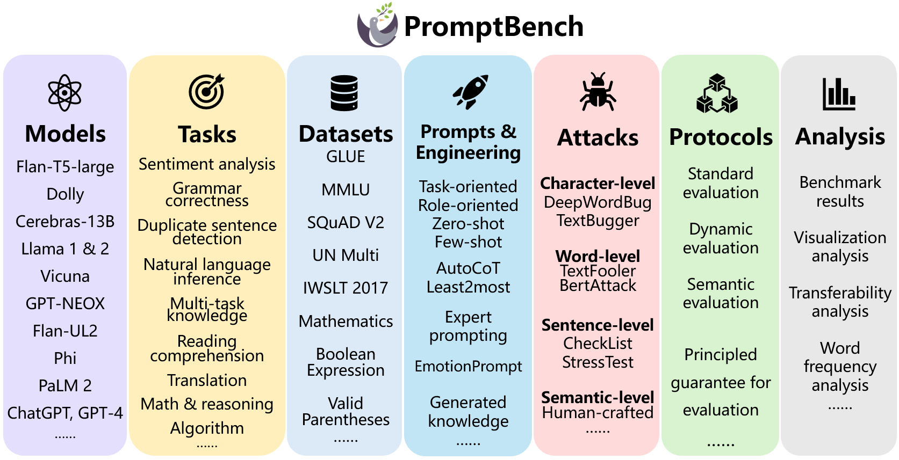

<div id="top"></div>
<!--
*** Thanks for checking out the Best-README-Template. If you have a suggestion
*** that would make this better, please fork the repo and create a pull request
*** or simply open an issue with the tag "enhancement".
*** Don't forget to give the project a star!
*** Thanks again! Now go create something AMAZING! :D
-->

<!-- PROJECT SHIELDS -->

<!--
*** I'm using markdown "reference style" links for readability.
*** Reference links are enclosed in brackets [ ] instead of parentheses ( ).
*** See the bottom of this document for the declaration of the reference variables
*** for contributors-url, forks-url, etc. This is an optional, concise syntax you may use.
*** https://www.markdownguide.org/basic-syntax/#reference-style-links
-->

[![Contributors][contributors-shield]][contributors-url]
[![Forks][forks-shield]][forks-url]
[![Stargazers][stars-shield]][stars-url]
[![Issues][issues-shield]][issues-url]
<!-- 
***[![MIT License][license-shield]][license-url]
-->

<!-- PROJECT LOGO -->

<br />
<div align="center">
  <a href="https://github.com/microsoft/promptbench">
    
  </a>

<!-- <h3 align="center">USB</h3> -->

<p align="center">
    <strong>PromptBench</strong>: A Unified Library for Evaluating and Understanding Large Language Models.
    <!-- <br />
    <a href="https://github.com/microsoft/promptbench"><strong>Explore the docs »</strong></a>
    <br /> -->
    <br />
    <a href="https://arxiv.org/abs/2312.07910">Paper</a>
    ·
    <a href="https://promptbench.readthedocs.io/en/latest/">Documentation</a>
    ·
    <a href="https://llm-eval.github.io/pages/leaderboard.html">Leaderboard</a>
    ·
    <a href="https://llm-eval.github.io/pages/papers.html">More papers</a>
  </p>
</div>

<!-- TABLE OF CONTENTS -->

<details>
  <summary>Table of Contents</summary>
  <ol>
    <li><a href="#news-and-updates">News and Updates</a></li>
    <li><a href="#introduction">Introduction</a></li>
    <li><a href="#installation">Installation</a></li>
    <li><a href="#usage">Usage</a></li>
    <li><a href="#supported-datasets-and-models">Datasets and Models</a></li>
    <li><a href="#benchmark-results">Benchmark Results</a></li>
    <li><a href="#acknowledgments">Acknowledgments</a></li>
  </ol>
</details>

<!-- News and Updates -->

## News and Updates
- [16/12/2023] Add support for Gemini, Mistral, Mixtral, Baichuan, Yi models.
- [15/12/2023] Add detailed instructions for users to add new modules (models, datasets, etc.) [examples/add_new_modules.md](examples/add_new_modules.md). 
- [05/12/2023] Published promptbench 0.0.1.


<!-- Introduction -->

## Introduction

**PromptBench** is a Pytorch-based Python package for Evaluation of Large Language Models (LLMs). It provides user-friendly APIs for researchers to conduct evaluation on LLMs. Check the technical report: https://arxiv.org/abs/2312.07910.




### What does promptbench currently provide?
1. **Quick model performance assessment:** We offer a user-friendly interface that allows for quick model building, dataset loading, and evaluation of model performance.
2. **Prompt Engineering:** We implemented several prompt engineering methods. For example: [Few-shot Chain-of-Thought](https://arxiv.org/abs/2201.11903) [1],  [Emotion Prompt](https://arxiv.org/abs/2307.11760) [2], [Expert Prompting](https://arxiv.org/abs/2305.14688) [3] and so on.
3. **Evaluating adversarial prompts:** promptbench integrated [prompt attacks](https://arxiv.org/abs/2306.04528) [4], enabling researchers to simulate black-box adversarial prompt attacks on models and evaluate their robustness (see details [here](promptbench/prompt_attack/README.md)).
4. **Dynamic evaluation to mitigate potential test data contamination:** we integrated the dynamic evaluation framework [DyVal](https://arxiv.org/pdf/2309.17167) [5], which generates evaluation samples on-the-fly with controlled complexity.


<!-- GETTING STARTED -->

## Installation

### Install via `pip`
We provide a Python package *promptbench* for users who want to start evaluation quickly. Simply run:
```sh
pip install promptbench
```

Note that the pip installation could be behind the recent updates. So, if you want to use the latest features or develop based on our code, you should install via GitHub.

### Install via GitHub

First, clone the repo:
```sh
git clone git@github.com:microsoft/promptbench.git
```

Then, 

```sh
cd promptbench
```

To install the required packages, you can create a conda environment:

```sh
conda create --name promptbench python=3.9
```

then use pip to install required packages:

```sh
pip install -r requirements.txt
```

Note that this only installed basic python packages. For Prompt Attacks, you will also need to install [TextAttack](https://github.com/QData/TextAttack).


## Usage

promptbench is easy to use and extend. Going through the examples below will help you get familiar with promptbench for quick use, evaluate existing datasets and LLMs, or create your own datasets and models.


Please see [Installation](#installation) to install promptbench first. 

If promptbench is installed via `pip`, you can simply do:

```python
import promptbench as pb
```

If you installed promptbench from `git` and want to use it in other projects:

```python
import sys

# Add the directory of promptbench to the Python path
sys.path.append('/home/xxx/promptbench')

# Now you can import promptbench by name
import promptbench as pb
```


We provide tutorials for:

1. **evaluate models on existing benchmarks:** please refer to the [examples/basic.ipynb](examples/basic.ipynb) for constructing your evaluation pipeline.
2. **test the effects of different prompting techniques:** 
3. **examine the robustness for prompt attacks**, please refer to [examples/prompt_attack.ipynb](examples/prompt_attack.ipynb) to construct the attacks.
4. **use DyVal for evaluation:** please refer to [examples/dyval.ipynb](examples/dyval.ipynb) to construct DyVal datasets.


## Implemented Components

PromptBench currently supports different datasets, models, prompt engineering methods, adversarial attacks, and more. You are welcome to add more.

### Datasets

- GLUE: SST-2, CoLA, QQP, MRPC, MNLI, QNLI, RTE, WNLI
- MMLU
- BIG-Bench Hard (Bool logic, valid parentheses, date...)
- Math
- GSM8K
- SQuAD V2
- IWSLT 2017
- UN Multi
- CSQA (CommonSense QA)
- Numersense
- QASC
- Last Letter Concatenate

### Models

- Open-source models:
  - google/flan-t5-large
  - databricks/dolly-v1-6b
  - Llama2 series
  - vicuna-13b, vicuna-13b-v1.3
  - Cerebras/Cerebras-GPT-13B
  - EleutherAI/gpt-neox-20b
  - Google/flan-ul2
  - phi-1.5 and phi-2
- Proprietary models
  - PaLM 2
  - GPT-3.5
  - GPT-4
  - Gemini Pro

### Prompt Engineering

- Chain-of-thought (COT) [1]
- EmotionPrompt [2]
- Expert prompting [3]
- Zero-shot chain-of-thought
- Generated knowledge [6]
- Least to most [7]

### Adversarial Attacks

- Character-level attack
  - DeepWordBug
  - TextBugger
- Word-level attack
  - TextFooler
  - BertAttack
- Sentence-level attack
  - CheckList
  - StressTest
- Semantic-level attack
  - Human-crafted attack

### Protocols and Analysis
- Standard evaluation
- Dynamic evaluation
- Semantic evaluation
- Benchmark results
- Visualization analysis
- Transferability analysis
- Word frequency analysis

## Benchmark Results

Please refer to our [benchmark website](https://llm-eval.github.io/) for benchmark results on Prompt Attacks, Prompt Engineering and Dynamic Evaluation DyVal.

## TODO

- [ ] Add support for multi-modal models such as LlaVa and BLIP2.

## Acknowledgements

- [TextAttack](https://github.com/QData/TextAttack)
- [README Template](https://github.com/othneildrew/Best-README-Template)
- We thank the volunteers: Hanyuan Zhang, Lingrui Li, Yating Zhou for conducting the semantic preserving experiment in Prompt Attack benchmark.


## Reference
[1] Jason Wei, et al. "Chain-of-Thought Prompting Elicits Reasoning in Large Language Models." arXiv preprint arXiv:2201.11903 (2022).

[2] Cheng Li, et al. "Emotionprompt: Leveraging psychology for large language models enhancement via emotional stimulus." arXiv preprint arXiv:2307.11760 (2023).

[3] BenFeng Xu, et al. "ExpertPrompting: Instructing Large Language Models to be Distinguished Experts" arXiv preprint arXiv:2305.14688 (2023).

[4] Zhu, Kaijie, et al. "PromptBench: Towards Evaluating the Robustness of Large Language Models on Adversarial Prompts." arXiv preprint arXiv:2306.04528 (2023).

[5] Zhu, Kaijie, et al. "DyVal: Graph-informed Dynamic Evaluation of Large Language Models." arXiv preprint arXiv:2309.17167 (2023).

[6] Liu J, Liu A, Lu X, et al. Generated knowledge prompting for commonsense reasoning[J]. arXiv preprint arXiv:2110.08387, 2021.

[7] Zhou D, Schärli N, Hou L, et al. Least-to-most prompting enables complex reasoning in large language models[J]. arXiv preprint arXiv:2205.10625, 2022.

<!-- CITE -->

## Citing promptbench and other research papers

Please cite us if you find this project helpful for your project/paper:

```
@article{zhu2023promptbench2,
  title={PromptBench: A Unified Library for Evaluation of Large Language Models},
  author={Zhu, Kaijie and Zhao, Qinlin and Chen, Hao and Wang, Jindong and Xie, Xing},
  journal={arXiv preprint arXiv:2312.07910},
  year={2023}
}

@article{zhu2023promptbench,
  title={PromptBench: Towards Evaluating the Robustness of Large Language Models on Adversarial Prompts},
  author={Zhu, Kaijie and Wang, Jindong and Zhou, Jiaheng and Wang, Zichen and Chen, Hao and Wang, Yidong and Yang, Linyi and Ye, Wei and Gong, Neil Zhenqiang and Zhang, Yue and others},
  journal={arXiv preprint arXiv:2306.04528},
  year={2023}
}

@article{zhu2023dyval,
  title={DyVal: Graph-informed Dynamic Evaluation of Large Language Models},
  author={Zhu, Kaijie and Chen, Jiaao and Wang, Jindong and Gong, Neil Zhenqiang and Yang, Diyi and Xie, Xing},
  journal={arXiv preprint arXiv:2309.17167},
  year={2023}
}

@article{chang2023survey,
  title={A survey on evaluation of large language models},
  author={Chang, Yupeng and Wang, Xu and Wang, Jindong and Wu, Yuan and Zhu, Kaijie and Chen, Hao and Yang, Linyi and Yi, Xiaoyuan and Wang, Cunxiang and Wang, Yidong and others},
  journal={arXiv preprint arXiv:2307.03109},
  year={2023}
}

```

<!-- CONTRIBUTING -->

## Contributing

This project welcomes contributions and suggestions.  Most contributions require you to agree to a
Contributor License Agreement (CLA) declaring that you have the right to, and actually do, grant us
the rights to use your contribution. For details, visit https://cla.opensource.microsoft.com.

When you submit a pull request, a CLA bot will automatically determine whether you need to provide
a CLA and decorate the PR appropriately (e.g., status check, comment). Simply follow the instructions
provided by the bot. You will only need to do this once across all repos using our CLA.

This project has adopted the [Microsoft Open Source Code of Conduct](https://opensource.microsoft.com/codeofconduct/).
For more information see the [Code of Conduct FAQ](https://opensource.microsoft.com/codeofconduct/faq/) or
contact [opencode@microsoft.com](mailto:opencode@microsoft.com) with any additional questions or comments.

If you have a suggestion that would make promptbench better, please fork the repo and create a pull request. You can also simply open an issue with the tag "enhancement".
Don't forget to give the project a star! Thanks again!

1. Fork the project
2. Create your branch (`git checkout -b your_name/your_branch`)
3. Commit your changes (`git commit -m 'Add some features'`)
4. Push to the branch (`git push origin your_name/your_branch`)
5. Open a Pull Request


<!-- TRADEMARKS -->

## Trademarks

This project may contain trademarks or logos for projects, products, or services. Authorized use of Microsoft
trademarks or logos is subject to and must follow
[Microsoft&#39;s Trademark &amp; Brand Guidelines](https://www.microsoft.com/en-us/legal/intellectualproperty/trademarks/usage/general).
Use of Microsoft trademarks or logos in modified versions of this project must not cause confusion or imply Microsoft sponsorship.
Any use of third-party trademarks or logos are subject to those third-party's policies.


<!-- MARKDOWN LINKS & IMAGES -->

<!-- https://www.markdownguide.org/basic-syntax/#reference-style-links -->

[contributors-shield]: https://img.shields.io/github/contributors/microsoft/promptbench.svg?style=for-the-badge
[contributors-url]: https://github.com/microsoft/promptbench/graphs/contributors
[forks-shield]: https://img.shields.io/github/forks/microsoft/promptbench.svg?style=for-the-badge
[forks-url]: https://github.com/microsoft/promptbench/network/members
[stars-shield]: https://img.shields.io/github/stars/microsoft/promptbench.svg?style=for-the-badge
[stars-url]: https://github.com/microsoft/promptbench/stargazers
[issues-shield]: https://img.shields.io/github/issues/microsoft/promptbench.svg?style=for-the-badge
[issues-url]: https://github.com/microsoft/promptbench/issues
[license-shield]: https://img.shields.io/github/license/microsoft/promptbench.svg?style=for-the-badge
[license-url]: https://github.com/microsoft/promptbench/blob/main/LICENSE.txt
